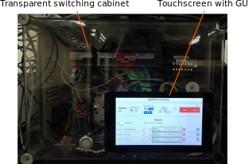

# Hardware layout

The hardware of the interlock system is based on an raspberry pi with [pi-plates cards](https://pi-plates.com/). The pi-plates are connected to the raspberry pi via the GPIO ports. This assembly is mounted on a DIN-rail inside a plastic switch cabinet. On the cabinet, there is a touch screen mounted that allows the user to interact with the GUI.

## Inside the Interlock box

The whole assembly is powered by a 5V/6A power supply. The power is than wired through the heartbeat relay to the raspberry pi.

### Heartbeat safety relay

The heartbeat relay [WZR-1.pdf (relmatic.ch)](http://www.relmatic.ch/data/de/ec/WZR-1.pdf) is a simple device that takes a TTL signal as an input. If the input signal doesn't flip during a predefined time, the heartbeat relay with switch, leading to a complete shutdown of the interlock. The software of the interlock is designed in a way that one of the digital outputs of the pi-plates card switches state whenever one cycle of checking all the inputs has been performed. If, out of whatever reason the raspberry pi get stuck and doesn't perform regular checks (about once per second) of the import values, the heartbeat relay will trigger and cut the power to the entire interlock and therefore switching down all of the connected devices. The staircase relay is used to bypass the heartbeat relay for a short period of time. This allows the interlock to restart.

### Raspberry pi with pi-plates

The core of the interlock device is a raspberry pi 4B paired with several pi-plates. Currently, we are using 2 [DAQC2plates](https://pi-plates.com/daqc2r1/) and 1 [THERMOplate](https://pi-plates.com/thermoplate/). Like this we have

- 8x K-type thermometer inputs, 4x digital thermometer inputs
- 16x digital inputs
- 16x digital outputs
- 16x 16 bit analog inputs
- 8x 12 bit analog outputs
- 4x 10 bit pwm outputs

This allows us to have more than enough connectivity to control our devices in the lab.

### Switching relays

In order to switch other devices, like the lasers, power supplies, laser warning sign, ... , we use solid state relays. This could of course also me done with mechanical relays.

### Input-Output connectors

The inputs and outputs of the interlock are connected using two different types of connectors. Either we used BNC connectors or DIN rail feed-through terminal blocks.