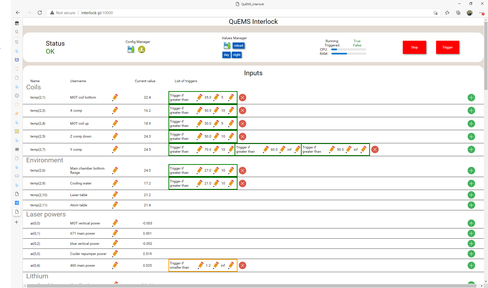
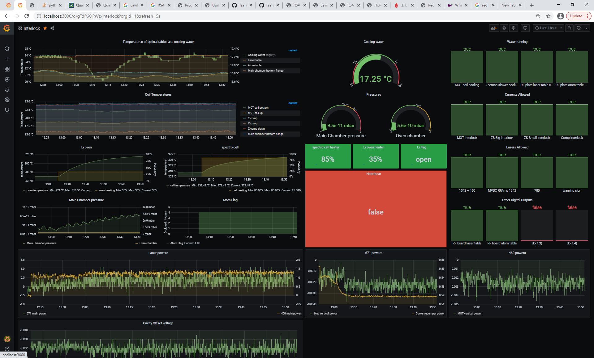

# What is the QuEMS_Interlock?

The QuEMS Intelock is a device to ensure the safety on an experiment and log important environmental parameters, like temperatures, laser powers, vacuum pressures, and so on. Its hardware is based on an raspberry pi with [pi-plates cards](https://pi-plates.com/). There are several important features that I would like to present here:

- Double safety by heartbeat relay
- Connection to devices via USB, Ethernet, AI, AO, DI, DO, K-type thermometers, Digital thermometers
- Web-based user interface implemented with [REMI](https://github.com/dddomodossola/remi).
- Datalogging with [Influxdb](https://www.influxdata.com/) and [Grafana](https://grafana.com/).

The code has been developed by the [laboratory of quantum gases](https://www.epfl.ch/labs/lqg/). Check our [github page](https://github.com/LQG-EPFL) for other useful tools.

# GUI and Grafana

The two ways to interact with the interlock are the gui and grafana. In the gui the outputs, trigger conditions can be set. Also the interlock warns the user acoustically if any issue was detected. This is realised by the test reading feature of standard browsers.

The logged input and output values can be accessed through grafana.

