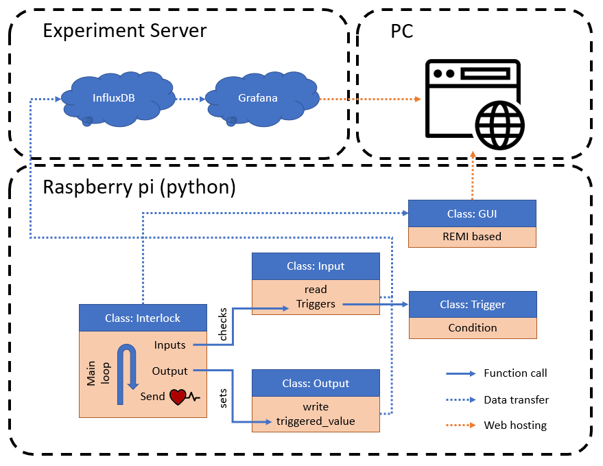

# Structure of QuEMS Interlock software

The interlock software can be divided in three parts, the interlock class, the REMI based GUI which are running on the raspberry pi and the influxDB+grafana running on the experiment server. All the user interfaces are web-based which allows the user to access the software from many different devices.

The diagram below illustrates the structure of the interlock code.

The central piece of the software is the Interlock class. It can read all the inputs and control all the outputs.

Once the interlock is stated, a thread in the interlock class loops over three different steps:

1. Check if all triggers on the inputs are fine (for example: Check if coil temperatures are in bounds)
2. If a problem has been detected, the interlock will trigger and the outputs will be set to their triggered value.
3. The heartbeat signal is send

Whenever an input value is read or an output value is set, the data is sent to the GUI and the influxDB database. It is important to note that the interlock class is totally independent from the GUI. The communications are done with a try and expect. This ensures that communication issues will not lead to a crash of the system.